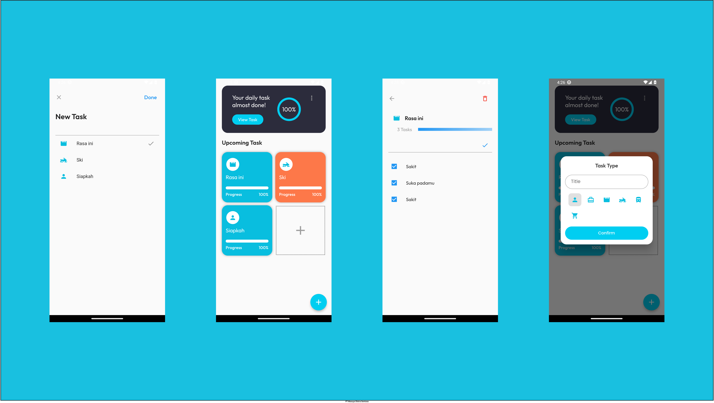

# To-Do List Manager

To-Do List Manager adalah aplikasi sederhana untuk mengelola tugas-tugas Anda dengan mudah dan efisien. Aplikasi ini memungkinkan pengguna membuat judul untuk setiap tugas yang akan diberikan, dengan kemampuan untuk menambahkan beberapa task di dalamnya. Setiap task dapat dicentang sebagai tanda penyelesaian, dan secara otomatis, persentase penyelesaian dari setiap tugas akan dihitung dan mencerminkan kemajuan proyek.

## Fitur Utama:

### 1. Judul Tugas
- Pengguna dapat membuat judul tugas sebagai judul utama untuk setiap proyek atau aktivitas yang akan dikerjakan.

### 2. Task di Dalam Judul
- Setiap judul tugas dapat diisi dengan beberapa task yang diperlukan untuk menyelesaikan tugas tersebut.

### 3. Penyelesaian Task
- Task dapat dicentang untuk menunjukkan bahwa mereka telah selesai, memberikan gambaran visual tentang progres keseluruhan tugas.

### 4. Persentase Penyelesaian
- Persentase penyelesaian dari setiap judul tugas dihitung secara otomatis dan ditampilkan di halaman utama (dashboard), memberikan gambaran keseluruhan proyek.

## Screenshot Aplikasi

Dengan To-Do List Manager, Anda dapat dengan mudah melacak dan mengelola tugas-tugas Anda dalam satu aplikasi yang efisien dan mudah digunakan. Selamat mengatur dan menyelesaikan tugas Anda!